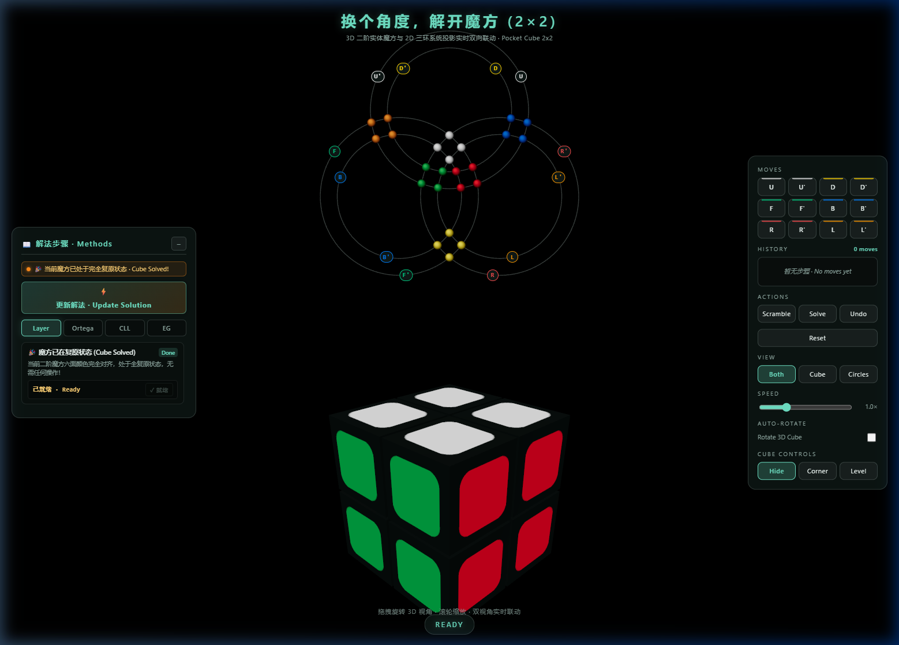
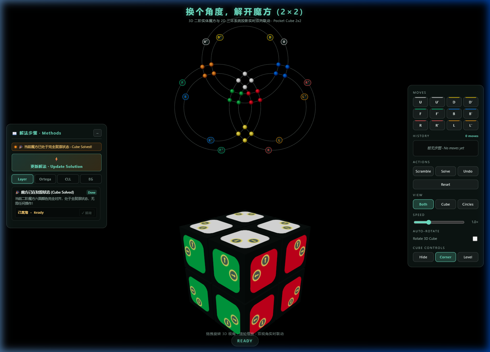
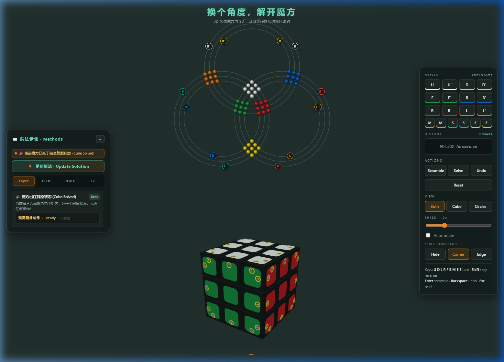

# 换个角度，解开魔方 · Rubik's Circles

A Three.js web application that visualizes a Rubik's cube simultaneously in **3D physical space** and **2D three-ring group projection**:

- **Below** — the familiar solid puzzle in interactive 3D, featuring on-piece directional rotation badges and realistic lighting.
- **Above** — the same cube drawn flat across three intersecting circle systems, one per spatial axis. Every sticker rests on a circular track; face and slice rotations smoothly sweep beads along circular arcs and transfer them across intersecting tracks in real time.
- **Solving Engine & Guide** — real-time step-by-step solution algorithms across multiple speedcubing methods (CFOP, Roux, ZZ, Layer-by-Layer for 3×3; Ortega, CLL, EG for 2×2) with one-click step execution.

---

## Preview

### 3×3 Rubik's Circles (`cubex3.html`)



*3×3 Rubik's Circles in solved state featuring the 2D Three-Ring projection (top), 3D cube with 12-button symmetrical corner & edge directional badges (bottom), and HUD with full face and slice moves (`U`, `D`, `L`, `R`, `F`, `B`, `M`, `E`, `S`).*

---

### Step-by-Step Solving Guide & Scramble Tracking



*Scrambled 3×3 cube showing real-time bead distribution on the 2D rings, step-by-step method algorithm cards (White Cross, First Layer, Middle Layer, etc.), and complete move history with colored slice accents.*

---

### 2×2 Pocket Cube Circles (`cubex2.html`)



*2×2 Pocket Cube representation with 2D circles, level controllers, and speedcubing method guides (Layer, Ortega, CLL, EG).*

---

## Run it

```bash
node server.mjs
```

Then open your browser to:
- **3×3 Cube**: <http://localhost:5173/cubex3.html>
- **2×2 Pocket Cube**: <http://localhost:5173/cubex2.html>
- **Base Version**: <http://localhost:5173/index.html>

`npm run dev` starts the same server. There is no build step and no `npm install` — the app loads Three.js directly via modern ES modules and import maps, and `server.mjs` is a zero-dependency static file server built on `node:http`.

---

## Controls

### Keyboard Shortcuts

| Input | Action |
| --- | --- |
| `U` `D` `L` `R` `F` `B` | Quarter turn of outer face, clockwise from outside |
| `M` `E` `S` | Quarter turn of middle slice (`M` follows L, `E` follows D, `S` follows F) |
| `Shift` + key | Reverse the turn direction (`U'`, `M'`, `S'`, etc.) |
| `Enter` | Scramble cube using verified tournament profiles |
| `Backspace` | Undo the previous move |
| `Esc` | Reset cube to solved state |
| `↑` `↓` `←` `→` | Rotate 3D camera viewpoint in 30° / 90° increments |
| Drag & Scroll | Orbit and zoom the 3D cube camera |

### On-Cube 3D Badges & HUD Controls

- **Cube Controls Modes**:
  - **`Corner` (Default)**: 12 directional arrow badges per face arranged on the 4 corner pieces (2 arrows each) and 4 edge pieces (1 arrow each), forming a complete 3×3 navigation grid:
    - 3 top buttons `[↑]` turn columns up (`L'`, `M'`, `R`)
    - 3 bottom buttons `[↓]` turn columns down (`L`, `M`, `R'`)
    - 3 left buttons `[←]` turn rows left (`U`, `E`, `D'`)
    - 3 right buttons `[→]` turn rows right (`U'`, `E'`, `D`)
  - **`Edge`**: Bidirectional level-rotation badges at the center of each edge.
  - **`Hide`**: Hides all on-piece badges for clean inspection.
- **View Switcher**: Toggle between `Both` (dual 2D/3D split view), `Cube` (full 3D scene), or `Circles` (full 2D diagram).
- **History Chips**: Click any move in the history panel to roll back to that exact state.

---

## How It Is Put Together

```
cubex3.html        Standalone 3×3 app: 3D cube, 2D circles, 12-button controller, solver methods
cubex2.html        Standalone 2×2 app: 2D circles projection, level controls, EG/Ortega solver
index.html         Base single-page entry with dual viewports
styles.css         HUD layout, glassmorphism panel styling, typography
server.mjs         Zero-dependency static server
src/config.js      Colors, lattice spacing, diagram radii & centers
src/cube.js        Cube mathematical state, 26 cubies, quaternion transformations
src/flat.js        Flat three-ring diagram scene & projection mathematics
src/moveEngine.js  Move parsing, animation queue, scramble / undo / solve
src/ui.js          Buttons, keyboard listeners, history ticker
src/main.js        Scene composition, lights, viewports, render loop
assets/            Screenshot previews and graphical assets
```

### One State, Two Pictures

`cube.js` (and the inline engine in `cubex3.html`) owns the authoritative puzzle state: each cubie carries integer lattice coordinates plus a quaternion orientation, rewritten exactly after every turn so nothing drifts however long you play.

A quarter turn is $-90^\circ$ about the face's *outward* normal, which is "clockwise seen from outside" for all six faces with no special cases. Slices rotate about corresponding central axes ($M \to L$, $E \to D$, $S \to F$). All views register as observers and animate the exact same turn parameters, ensuring the 3D cube and 2D circular diagram are always in 100% agreement.

### Laying Out the Circles

The cube has three spatial axes, so the diagram has three primary circle systems:
- **$Y$ axis (U/D)**: Top circle system
- **$Z$ axis (F/B)**: Bottom-left circle system
- **$X$ axis (R/L)**: Bottom-right circle system

Each axis contains concentric circles corresponding to outer layers and middle slices ($r_0 - \delta$, $r_0$, $r_0 + \delta$). Sticker positions are determined mathematically by solving circle-circle intersections, placing every bead precisely where the respective planes intersect in projection space.

### Animating a Turn

During any move, stickers on the rotating layer or slice are smoothly interpolated along their active circular track or face center. As a face or slice completes its turn, the 3D cubies and 2D beads snap into their new permutation, updating the solution steps and move history synchronously.
