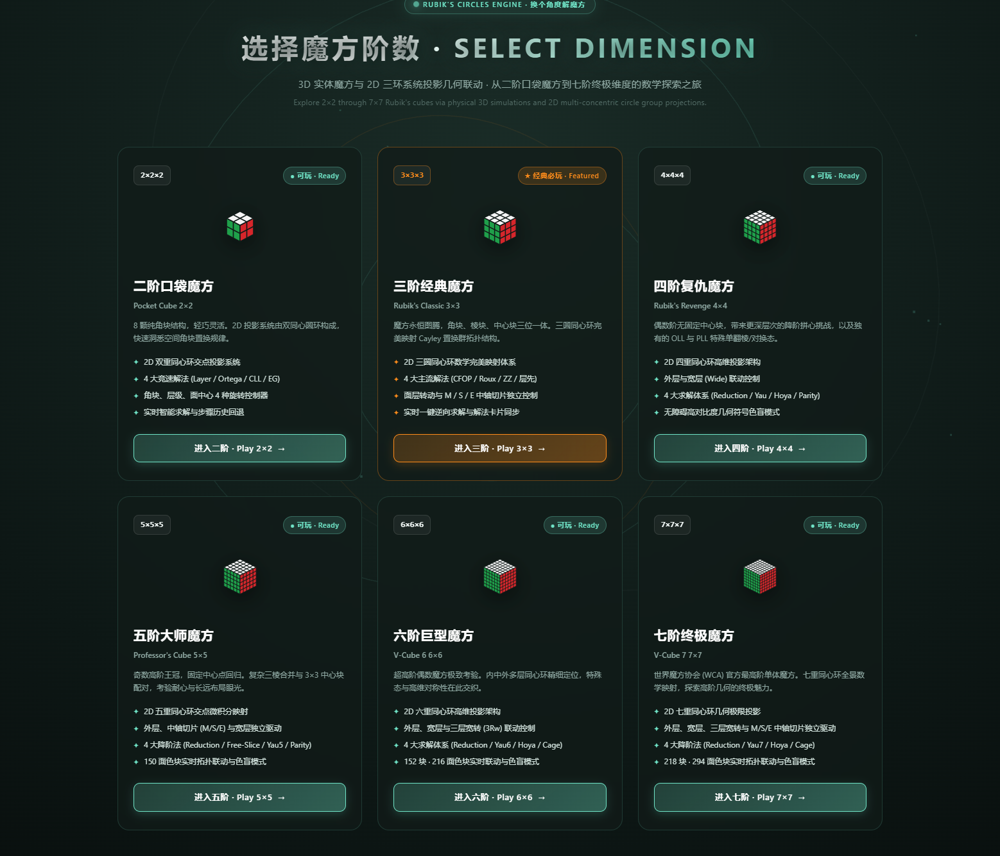
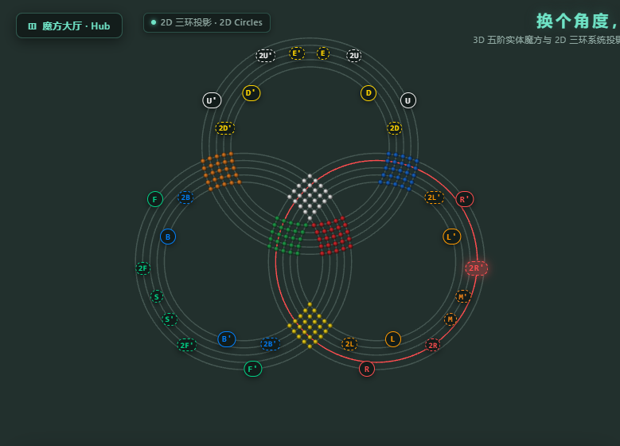
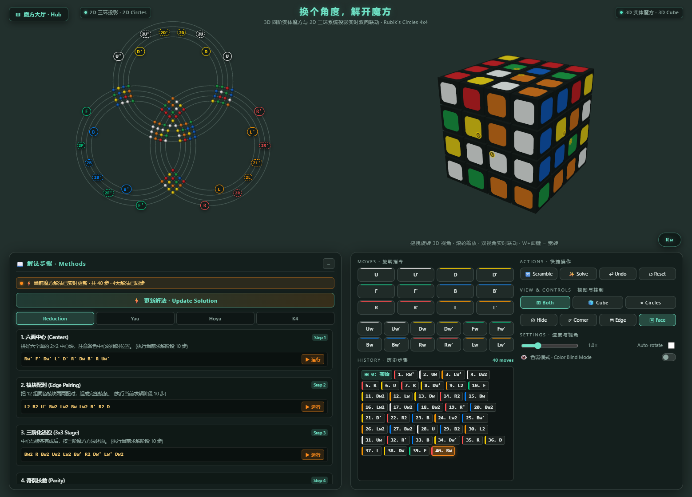
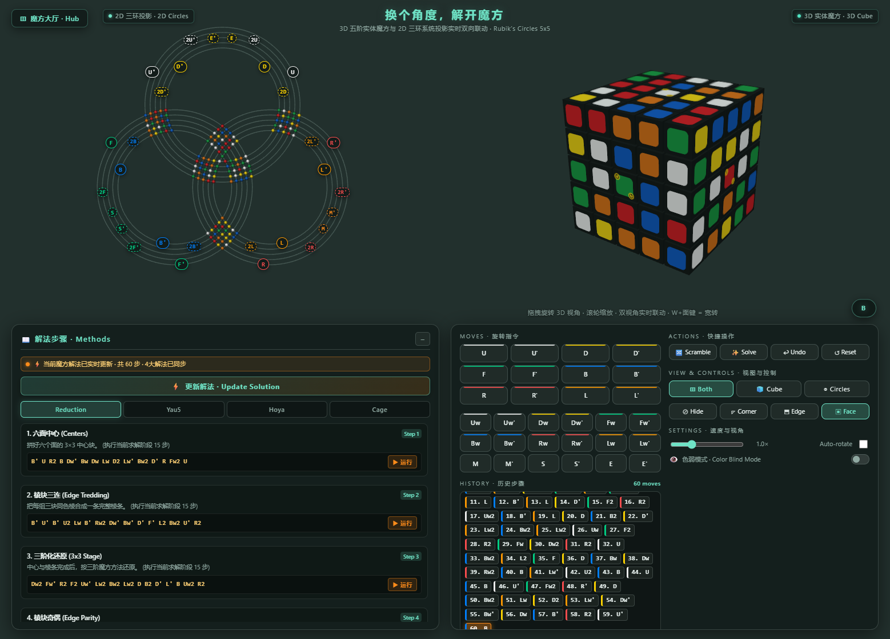
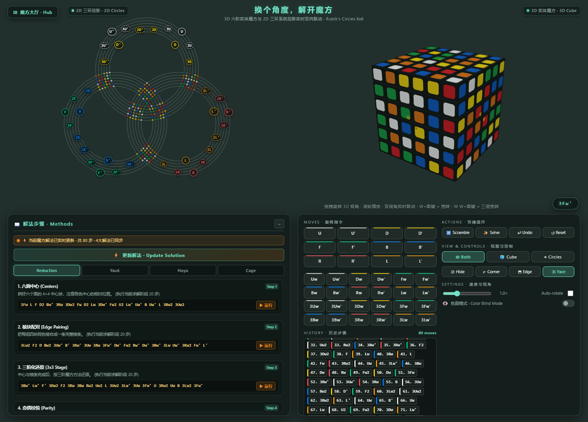
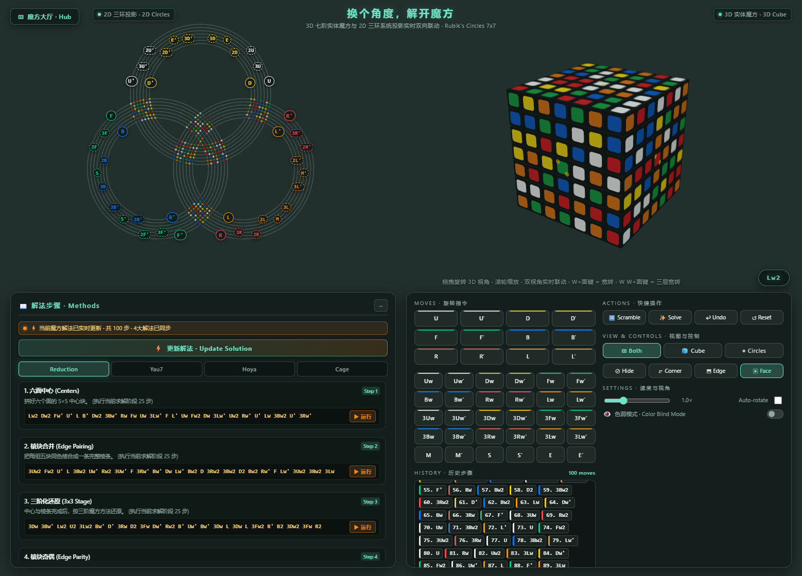

# 换个角度，解开魔方 · Rubik's Circles

A Three.js web application that shows a Rubik's cube in **3D physical space** and as a **2D three-ring group projection** at the same time. It covers every size from the 2×2 Pocket Cube to the 7×7 V-Cube 7:

- **3D cube (right)** — the familiar solid puzzle, with on-piece rotation badges, orbit camera and realistic lighting.
- **2D circles (left)** — the same cube drawn flat across three intersecting circle systems, one per spatial axis. Every sticker is a bead resting where two rings cross; a turn sweeps the beads along their ring and hands them across to the neighbouring rings.
- **Solving guide (bottom)** — step-by-step algorithms derived from the live cube, split across several speedcubing methods, with one-click step execution and full move history.

---

## Preview

### Hub · pick a cube size (`index.html`)



*The hub lists all six cubes. Each card opens a standalone page.*

---

### 3×3 Rubik's Circles (`cubex3.html`)


*Solved 3×3. The 2D circles carry a button pair on every ring: outer faces `U` `F` `R`, inner faces `D` `B` `L`, and the dashed middle-slice buttons `E` `S` `M`. The 3D cube and the HUD offer the full set of face and slice moves.*

---

### Step-by-Step Solving Guide & Scramble Tracking


*A scrambled 3×3: beads spread across the rings, method cards (White Cross, First Layer, Middle Layer …) with runnable steps, and the move history with face-coloured chips.*

---

### Ring Highlight on Hover



*Hovering a ring button lights the ring it turns, in the button's own colour. This is `2R'` on the 5×5. A turn in progress keeps its orange highlight, and the hover colour returns once the turn lands.*

---

### 2×2 Pocket Cube Circles (`cubex2.html`)


*2×2 Pocket Cube with two rings per circle system, level controllers, and the Layer, Ortega, CLL and EG method guides.*

---

### Big Cubes · 4×4 to 7×7 (`cubex4.html` – `cubex7.html`)

| 4×4 Rubik's Revenge | 5×5 Professor's Cube |
| :---: | :---: |
|  |  |
| **6×6 V-Cube 6** | **7×7 V-Cube 7** |
|  |  |

*Each big cube adds one ring per layer. Every ring between the outer and inner faces gets its own smaller dashed button pair (`2U`, `3U`, `E` …). The HUD adds wide-turn rows (`Uw`, and `3Uw` on 6×6 / 7×7), plus `M` `S` `E` on odd cubes.*

---

## Run it

```bash
node server.mjs
```

Then open <http://localhost:5173/> for the hub, or go straight to a cube:

| Page | Cube |
| --- | --- |
| <http://localhost:5173/cubex2.html> | 2×2 Pocket Cube |
| <http://localhost:5173/cubex3.html> | 3×3 Rubik's Cube |
| <http://localhost:5173/cubex4.html> | 4×4 Rubik's Revenge |
| <http://localhost:5173/cubex5.html> | 5×5 Professor's Cube |
| <http://localhost:5173/cubex6.html> | 6×6 V-Cube 6 |
| <http://localhost:5173/cubex7.html> | 7×7 V-Cube 7 |

`npm run dev` starts the same server, and `PORT=8080 node server.mjs` picks another port. There is no build step and no `npm install`: every page loads Three.js from a CDN through an import map, and `server.mjs` is a zero-dependency static file server built on `node:http`.

---

## Controls

### Keyboard Shortcuts

| Input | Action |
| --- | --- |
| `U` `D` `L` `R` `F` `B` | Quarter turn of an outer face, clockwise as seen from outside that face |
| `M` `E` `S` | Middle slice (`M` follows L, `E` follows D, `S` follows F). 3×3, 5×5 and 7×7 only |
| `W` then a face key | Wide turn of the outer two layers (`Rw`). 4×4 and up |
| `W` `W` then a face key | Wide turn of the outer three layers (`3Rw`). 6×6 and 7×7 |
| `Shift` + key | Reverse the turn (`U'`, `M'`, `Rw'` …) |
| `Enter` | Scramble with the next named scramble profile |
| `Backspace` | Undo the previous move |
| `Esc` | Reset the cube to solved |
| `↑` `↓` / `←` `→` | Tilt the 3D camera 30° / swing it 90° |
| Drag & Scroll | Orbit and zoom the 3D camera |

### 2D Circle Buttons

- **One pair per ring.** Every ring has a prime (`'`) and a normal button. Outer and inner face rings use solid pills. Middle rings use smaller dashed pills in the colour of the face they turn with.
- **Hover to find the ring.** Hovering a button lights its ring in the button's colour.
- **Why `F'` and `B'` spin opposite ways.** Each face's direction is judged looking straight at that face. The bottom-left circle draws F and B from the same front viewpoint, so on screen `F'` goes counter-clockwise and `B'` clockwise. The same holds for `U'`/`D'` and `R'`/`L'`, just as on a real cube.

### On-Cube 3D Badges & HUD

- **Controller modes** (next to the cube, and in the HUD):
  - **`Face` (default)**: rotation badges on each face.
  - **`Corner`**: directional arrows around each face's border. There are 12 per face on the 3×3 and 4N on an N×N cube (16 on 4×4 up to 28 on 7×7). Each arrow turns the row or column it sits on, in the direction it points, including the inner layers (`2R`, `3U` …) on big cubes.
  - **`Edge`** (`Level` on the 2×2): bidirectional level-rotation badges at the middle of each edge.
  - **`Hide`**: no badges, for clean inspection.
- **View switcher**: `Both` (2D circles and 3D cube side by side), `Cube` (3D only) or `Circles` (2D only).
- **Moves panel**: every face turn, plus wide turns and middle slices where the cube has them.
- **History chips**: click any move in the history to roll back to that exact state.
- **Color Blind Mode**: adds a distinct symbol to every sticker colour, bead and button.

---

## Notation on Big Cubes

The pages use WCA notation.

| Move | Layers turned (counted from that face) |
| --- | --- |
| `R` | the outer layer |
| `2R` | the second layer only (one inner slice) |
| `3R` | the third layer only (6×6 and 7×7) |
| `Rw` | the outer two layers |
| `3Rw` | the outer three layers (6×6 and 7×7) |
| `M` `E` `S` | the exact middle slice, odd cubes only (`M` = `3L` on 5×5, `4L` on 7×7) |

A suffix `'` reverses the turn and `2` makes it a half turn. Each cube has a set of named scramble profiles (three on the 2×2, four on the others), and Scramble cycles through them. On the big cubes the standard profile uses the WCA scramble length: 40 moves on 4×4, 60 on 5×5, 80 on 6×6 and 100 on 7×7.

### Solving Methods per Cube

| Cube | Method tabs |
| --- | --- |
| 2×2 | Layer · Ortega · CLL · EG |
| 3×3 | Layer · CFOP · Roux · ZZ |
| 4×4 | Reduction · Yau · Hoya · K4 |
| 5×5 | Reduction · Yau5 · Hoya · Cage |
| 6×6 | Reduction · Yau6 · Hoya · Cage |
| 7×7 | Reduction · Yau7 · Hoya · Cage |

On every cube, each method shows the same solution derived from the live cube, split across that method's stages. No algorithm is hard-coded.

---

## How It Is Put Together

```
index.html         Hub page: pick a cube size
cubex2.html        Standalone 2×2 app
cubex3.html        Standalone 3×3 app
cubex4.html        Standalone 4×4 app  ┐
cubex5.html        Standalone 5×5 app  │ generic N×N layer model,
cubex6.html        Standalone 6×6 app  │ wide turns, generated arrows
cubex7.html        Standalone 7×7 app  ┘
server.mjs         Zero-dependency static server
assets/            README screenshots
src/, styles.css   The original modular 3×3 prototype (not loaded by the pages above)
```

Each `cubexN.html` is self-contained: markup, styles, the 3D cube, the 2D diagram, the move engine and the solving guide are all in one file.

### One State, Two Pictures

The cube model owns the authoritative puzzle state. Each cubie carries integer lattice coordinates plus a quaternion orientation, rewritten exactly after every turn, so nothing drifts however long you play. Big cubes use a step-2 lattice (`-(N-1) … N-1`), so every layer sits on an integer coordinate.

A quarter turn is $-90^\circ$ about the turning face's *outward* normal, which is "clockwise seen from outside" for all six faces with no special cases. Slices turn about the matching axis ($M \to L$, $E \to D$, $S \to F$). A move key such as `2R` or `3Rw` resolves to a face plus the layer depths it turns. Both views register as observers and animate the exact same turn, so the 3D cube and the 2D circles always agree.

### Laying Out the Circles

The cube has three spatial axes, so the diagram has three circle systems:
- **$Y$ axis (U/D)**: top circle system
- **$Z$ axis (F/B)**: bottom-left circle system
- **$X$ axis (R/L)**: bottom-right circle system

Each system has one concentric ring per layer of the cube: 2 rings on the 2×2 and 7 on the 7×7. The rings are spaced as widely as possible without any two stickers crowding each other. Sticker positions come from circle-circle intersections, so every bead lies exactly where its two rings cross.

### Animating a Turn

During a move, the beads on the turning layer sweep along their ring, or around the face centre for beads on the face itself. A wide turn moves several rings at once, and each bead follows the ring of its own layer. When the turn lands, the 3D cubies and 2D beads snap into their new permutation, and the solution steps and move history update together.
